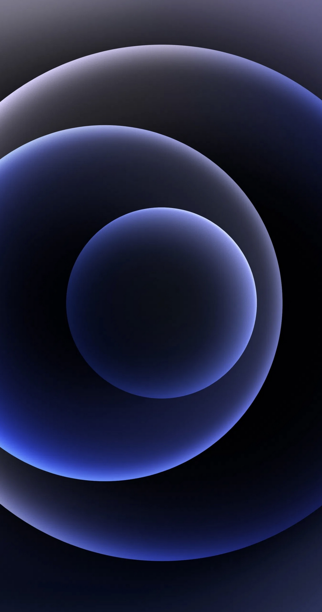

# iPhone 12 Pro Max 📱 Made By `HTML`, `CSS` & `JavaScript` ! 

# Hello there! 👋

I have created a [**Black color iPhone 12 Pro Max**](https://i-phone-12-shjz.vercel.app/) built with `HTML`, `CSS`, and some `JavaScript` !

## Here's how it looks like: 

### I tried to make it look as close as possible to the original iPhone:

**I also made the passcode screen, the homescreen, and even the camera app!**

## You can also check it out 👇! 

## [Live Site 🚀](https://i-phone-12-shjz.vercel.app/)
**or check out on** [Replit ==>](https://iPhone-12.bookie0.repl.co)

## Features ✨

- ## **Lockscreen**

- **Lockscreen wallpaper**
- **Lock icon**
- **Time and date**
- **Torch and camera icon**
- **Swipe up to unlock and home indicator animation**

**You can click the torch icon to `'Turn it on'` (doesn't actually work). You can also click the camera icon to go to the camera app, just like the real thing. Click the home indicator to unlock the iPhone.**

- ## **Camera**:

- **Image**
- **Using camera and microphone indicator**
- **Flash, hidden, live icons**
- **Zoom**
- **Modes**
- **Pictures**
- **Capture**
- **Rotate**

**You can click the capture button (satisfying)!**

## **Passcode**

- **Lock icon**
- Dots **
- **Numbers**
- Emergency and cancel buttons**

**You can actually type in a password and watch the dots fill in. Any password works.**

- ## **Home page**

- **Homepage wallpaper**
- Apps** 
- **3 dots** 
- **Menu bar**

**When the home page loads up, the apps have a kind of 'bounce-in' animation, similar to the one for iPhone.**

## Hardware 🔨

**For the hardware of the phone (case, buttons, notch, etc.), I tried to make it look like the real thing.** 

- **For the side buttons, you can see the ringer, volume, and power buttons. You can click the volume and power buttons, althought only the power button actually does something (it turns off the phone). When the phone is off, you can touch the screen (tap to wake) or click the power button again to turn the phone back on.**

- **The notch has the mic and the camera.**

- **The casing even has the little marks or dashes that look like this for the real iPhone:**

## 🎨 Styles:

- **Wallpapers**

**The lockscreen wallpaper is the [dark mode default wallpaper](https://replit.com/@Bookie0/iPhone-12#Images/Backgrounds/lockscreen.jpeg):**

**The homepage wallpaper is the [orange light mode iOS 13 wallpaper](https://replit.com/@Bookie0/iPhone-12#Images/Backgrounds/homescreen.jpeg) because I think it looks cool:**

### - **Fonts**
**The font family I used mostly is the default Apple font: `-apple-system, BlinkMacSystemFont, 'Segoe UI', Roboto, Oxygen, Ubuntu, Cantarell, 'Open Sans', 'Helvetica Neue', sans-serif`.**

I also used [San Francisco Compact](https://www.cufonfonts.com/font/sf-compact-display) for the camera app.

### - **Icons**

**Most of the icons come from [Apple's developer package icons](https://developer.apple.com/sf-symbols/), a great bundle of more than 3,000 symbols which you can customize.**

**One icon from the phone is from [Ionicons](https://ionic.io/ionicons) as I couldn't find it on the Apple package.**

### - **Bent effect**

**On iPhone's camera app, you can scroll sideways to scroll through the different camera modes (video, photo, slo-mo, etc.) and whilst I didn't make the scrolling, effect, I was able to make the bent effect.**

This is how it really looks like:

**And this is what I mananged to achieve:**

**I was able to do that by making the color of the letters at the far ends a different shade of gray, and I also used `transform: rotateY(50deg);` to kind of squish the letters more together and make them thinner. Hence, the bent effect was achieved.
Well, that's about all! Make sure to let me know any comments, suggestions, or questions if you have them! 😊**

## Here's what you can basically The iPhone do:

- **Click the power button on the right to turn the phone on/off**
- **Click the home indicator on the bottom and type in a password to go to home**
- **Click the camera icon for camera**
- **Click the torch icon for torch**

# Licence

MIT LICENCE
Read `Licence` document for more details

# Bye! 👋

HOPE U LIKE THIS PROJECT PLEASE! IF YOU ARE USING THIS CODE PLEASE GIVE **HAMZA ZAIDI** SOME CREDITS BY LIKE & GIVE A HEART!!! 😃👍💛
